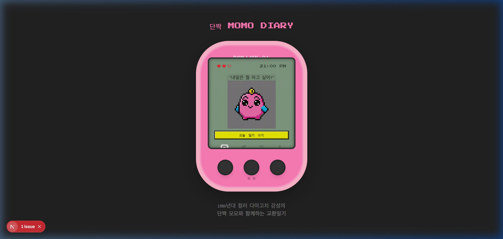
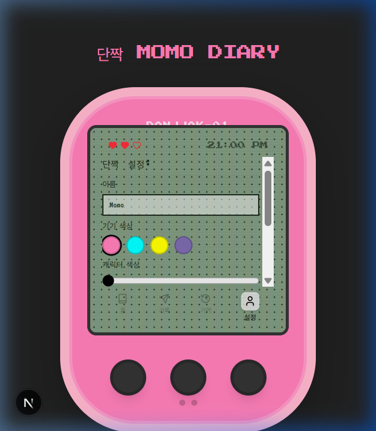

# 🐣 Momo Diary (Danjjak) - AI Pixel Companion



A nostalgic, 1980s color Tamagotchi-style AI diary application. Talk to your pixel friend "Momo", write your daily thoughts, and customize your digital companion.

---

## 🇺🇸 English

### 🌟 Overview
**Momo Diary** is a unique AI companion app designed with a retro 8-bit aesthetic. It combines the nostalgia of 1980s handheld virtual pets with modern AI-driven diary features. 

### 🚀 Key Features
- **AI Daily Questions**: Momo asks you a new question every day to help you reflect on your life.
- **One-Line Diary**: A simple, stress-free way to keep track of your daily moods and events.
- **Full Customization**: 
  - Change the device's shell color.
  - Customize the character's color using a hue slider.
  - Dress up Momo with accessories like hats, glasses, and ribbons.
- **Memory History**: Look back at your past entries stored safely in the "Memory" tab.
- **Retro LCD Effects**: Realistic scanlines, pixelated fonts, and grid patterns for a true vintage feel.

### 🛠️ Tech Stack
- **Framework**: Next.js 15 (App Router)
- **Styling**: Tailwind CSS 4
- **Animation**: Framer Motion
- **Icons**: Lucide React
- **Mobile Support**: Capacitor (Cross-platform Android/iOS)

---

## 🇯🇵 日本語

### 🌟 概要
**モモ日記 (Momo Diary)** は、1980年代後半のカラー・たまごっちの感性を再現したAI交換日記アプリです。ピクセルアートの相棒「モモ」と一緒に、日々の出来事を楽しく記録しましょう。

### 🚀 主な機能
- **AIの問いかけ**: モモが毎日違う質問をしてくれるので、日記を書くのが楽しみになります。
- **一言日記**: ストレスなく続けられる、シンプルな一言形式の記録。
- **フル・カスタマイズ**:
  - デバイスの本体カラーを変更可能。
  - キャラクターの体色を自由に変更（色相調整）。
  - 帽子、サングラス、リボンなどのアクセサリーでモモをドレスアップ。
- **思い出の記録**: 「記憶」タブから過去のすべての日記をいつでも振り返ることができます。
- **レトロな演出**: 走査線（スキャンライン）、ピクセルフォント、LCD風の背景パターンで完璧なビンテージ感を演出。

### 🛠️ 技術スタック
- **フレームワーク**: Next.js 15 (App Router)
- **スタイリング**: Tailwind CSS 4
- **アニメーション**: Framer Motion
- **アイコン**: Lucide React
- **モバイル対応**: Capacitor (Android/iOS クロスプラットフォーム)

---

## 📸 Screenshots

### Customization Options


### Getting Started
To run the web version locally:
```bash
cd momo-app
npm install
npm run dev
```

To open the Android version:
```bash
cd momo-app
npx cap open android
```
